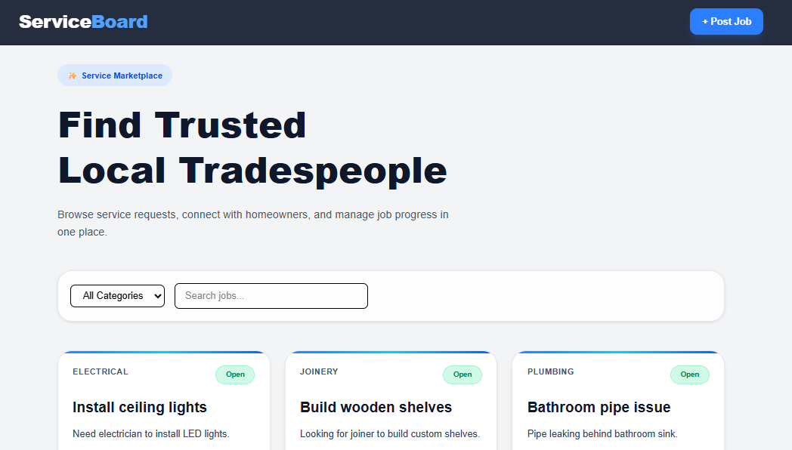
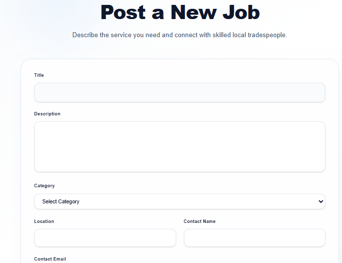
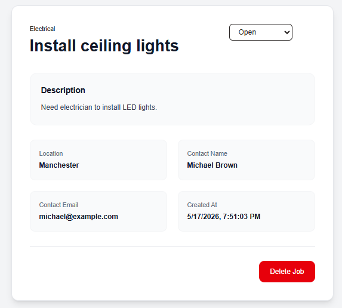

# Service Request Board

A modern full-stack web application where homeowners can post service requests and tradespeople can browse, manage, and update job statuses.

Built as part of the Full-Stack Developer Intern Technical Assessment.

---


# Screenshots

## Home Page



## Create Job Page



## Job Detail Page



---

# Features

## Core Features

* View all service requests
* Create new service requests
* View full job details
* Update job status
* Delete jobs
* Category filtering
* Responsive modern UI
* RESTful API architecture
* MongoDB database integration
* Input validation
* Global error handling

## Bonus Features

* Keyword search functionality
* Database seed script
* Modern SaaS-inspired UI design
* Environment-based configuration
* Responsive design for mobile and desktop

---

# Tech Stack

## Frontend

* Next.js (App Router)
* React
* Tailwind CSS
* Axios

## Backend

* Node.js
* Express.js
* MongoDB
* Mongoose
* Express Validator
* Morgan
* CORS
* Dotenv

## Deployment

* Vercel (Frontend)
* Render (Backend)
* MongoDB Atlas (Database)

---

# Project Structure

```txt
service-request-board/
│
├── Frontend/
│   ├── app/
│   ├── components/
│   ├── services/
│   ├── public/
│   └── ...
│
├── Backend/
│   ├── src/
│   │   ├── config/
│   │   ├── controllers/
│   │   ├── middleware/
│   │   ├── models/
│   │   ├── routes/
│   │   ├── validators/
│   │   └── server.js
│   │
│   ├── seed.js
│   └── ...
│
└── README.md
```

---

# API Endpoints

## Get All Jobs

```http
GET /api/jobs
```

### Optional Query Parameters

```http
GET /api/jobs?category=Plumbing
GET /api/jobs?status=Open
GET /api/jobs?search=plumber
```

---

## Get Single Job

```http
GET /api/jobs/:id
```

---

## Create New Job

```http
POST /api/jobs
```

### Request Body

```json
{
  "title": "Need plumber urgently",
  "description": "Kitchen sink leaking badly",
  "category": "Plumbing",
  "location": "Glasgow",
  "contactName": "John Doe",
  "contactEmail": "john@example.com"
}
```

---

## Update Job Status

```http
PATCH /api/jobs/:id
```

### Request Body

```json
{
  "status": "In Progress"
}
```

---

## Delete Job

```http
DELETE /api/jobs/:id
```

---

# Database Schema

## JobRequest

```js
{
  title: String,
  description: String,
  category: String,
  location: String,
  contactName: String,
  contactEmail: String,
  status: "Open" | "In Progress" | "Closed",
  createdAt: Date
}
```

---

# Environment Variables

## Backend

Create:

```txt
Backend/.env
```

Add:

```env
PORT=5000
MONGO_URI=your_mongodb_connection_string
```

---

## Frontend

Create:

```txt
Frontend/.env.local
```

Add:

```env
NEXT_PUBLIC_API_URL=http://localhost:5000/api
```

---

# Local Installation

## 1. Clone Repository

```bash
git clone https://github.com/your-username/service-request-board.git
```

```bash
cd service-request-board
```

---

# Backend Setup

## Navigate to Backend

```bash
cd Backend
```

## Install Dependencies

```bash
npm install
```

## Run Development Server

```bash
npm run dev
```

Backend runs on:

```txt
http://localhost:5000
```

---

# Frontend Setup

## Navigate to Frontend

```bash
cd Frontend
```

## Install Dependencies

```bash
npm install
```

## Run Development Server

```bash
npm run dev
```

Frontend runs on:

```txt
http://localhost:3000
```

---

# Database Seed Script

To populate the database with sample jobs:

```bash
cd Backend
```

```bash
npm run seed
```

This inserts sample service requests into MongoDB.

---

# Validation & Error Handling

## Backend Validation

Implemented using:

* Express Validator
* Mongoose schema validation

Validation includes:

* Required fields
* Email format validation
* Status enum validation
* Invalid MongoDB ObjectId handling

---

# UI & UX Improvements

The frontend UI was designed with a modern SaaS-inspired approach featuring:

* Responsive layouts
* Gradient accents
* Modern card design
* Interactive hover effects
* Improved typography hierarchy
* Glassmorphism-inspired elements
* Smooth transitions and animations

---

# Future Improvements

Potential future enhancements:

* JWT Authentication
* Role-based access control
* Unit and integration testing
* Pagination
* Image uploads
* Notifications system
* Real-time updates using WebSockets
